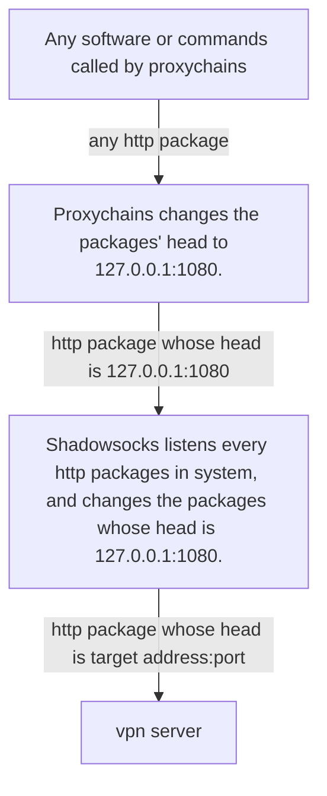

# VPN in Ubuntu
1. Software:
    - shadowsocks
    - proxychains
2. Explains:

(Local address (127.0.0.1:1080) can be changed by customer, such as (127.0.0.1:999)).

3. Shadowsocks:
    - installation: `sudo apt install shadowsocks-libev`
    - changing the configuration file: `/etc/shadowsock-libev/config.json`
        ```
        {
            "server":"vpn server's address",
            "server_port":vpn server's port,
            "local_address":"127.0.0.1",
            "local_port":1080,
            "passward":"your passward",
            "timeout":60,
            "method":"vpn server's encryption method, 
                        such as: aes-256-cfb, chacha20-ietf-poly1205"
        }
        ```
    - usage:
        - start: `sudo systemctl start shadowsocks-libev-local@config.service`
        - restart: `sudo systemctl restart shadowsocks-libev-local@config.service` 
        - stop: `sudo systemctl stop shadowsocks-libev-local@config.service` 
        - check shadowsocks' status: `sudo systemctl status shadowsocks-libev-local@config.service` 
        - automatically start when opening the computer: `sudo systemctl enable shadowsocks-libev-local@config.service` 
        - disable the automatically start: `sudo systemctl disable shadowsocks-libev-local@config.service` 

4. Proxychains:
    - installation: `sudo apt install proxychains`
    - changing the configuration file: `/etc/proxychains.conf`
        ```
        ...
        (Usually this is the last line.)
        socks5 127.0.0.1 1080
        ```
    - usage:
        - any software or command you want to run, such as:
            - `proxychains google-chrome`
            - `sudo proxychains apt install tensorflow-gpu`

